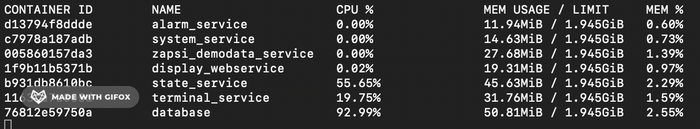

[](https://www.jetbrains.com/go/)
<br/>

[](https://github.com/petrjahoda/system/commits/master)
[](https://github.com/petrjahoda/system/issues)
<br/>

<br/>
[](https://www.postgresql.org)
[](https://www.docker.com)


# Manufacturing System

## Installation
Install under docker runtime using [this dockerfile image](https://github.com/petrjahoda/system/tree/master/latest) with this command: ```docker-compose up -d```
### Demoversion
Install under docker runtime using [this dockerfile image](https://github.com/petrjahoda/system/tree/master/demo) with this command: ```docker-compose up -d```<br>
This will install zapsi_demodata_service that generates pseudorandom machine data, so one can see the system in work.


## Implementation guide
Proper implementation and settings can be found in each github repository (see below).

## Requirements
By number of workplaces
* up to 10 workplaces -> 1GB RAM, 1 logical processor, approx. 10GB HDD of data per year
* up to 80 workplaces -> 8GB RAM, 8 logical processors, approx. 80GB HDD of data per year
* etc.

Example of CPU and Memory consumption when running 100 workplaces on 2CPU and 2GB RAM:


## Description
Manufacturing system is used for collecting data from factory machines and factory operators.<br>
Everything is stored in (postgresql) database with web as user interface.<br>
Additional software is used for processing data.<br>


### Database (PostgreSQL)
* Github: https://github.com/petrjahoda/database
* DockerHub: https://hub.docker.com/repository/docker/petrjahoda/database
### System Service
* Github: https://github.com/petrjahoda/system_service
* DockerHub: https://cloud.docker.com/r/petrjahoda/system_service   
### Zapsi Service
* Github: https://github.com/petrjahoda/zapsi_service
* DockerHub: https://hub.docker.com/repository/docker/petrjahoda/zapsi_service
### State Service
* Github: https://github.com/petrjahoda/state_service
* DockerHub: https://hub.docker.com/repository/docker/petrjahoda/state_service
### Terminal Service
* Github: https://github.com/petrjahoda/terminal_service
* DockerHub: https://cloud.docker.com/r/petrjahoda/terminal_service
### Alarm Service
* Github: https://github.com/petrjahoda/alarm_service
* DockerHub: https://cloud.docker.com/r/petrjahoda/alarm_service
### System Web Service
* Github: **work-in-progress** https://github.com/petrjahoda/system_web_service_beta
* DockerHub: **work-in-progress**
### Display Web Service
* Github: Github: https://github.com/petrjahoda/display_webservice
* DockerHub: https://cloud.docker.com/r/petrjahoda/display_webservice
### Zapsi Demodata Service
* Github: Github: https://github.com/petrjahoda/zapsi_demodata_service
* DockerHub: https://cloud.docker.com/r/petrjahoda/zapsi_demodata_service
    
© 2020 Petr Jahoda
